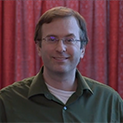

# Collaborators

## Jeanne Serb
{: .align-left}
Jeanne Serb is an evolutionary biologist whose work focuses on photosensory systems. She uses molluscs to study the genetic processes that drive the evolutionary conversion of non-visual tissue to a perceptual organ that senses light and to understand the biochemical mechanisms that are involved in light-sensitivity of proteins.  She currently is an Associate Professor in the Department of Ecology, Evolution and Organismal Biology and the Director for the Office of Biotechnology at Iowa State University. As Director, Jeanne and her team work with Iowa State’s biotechnology faculty and administrators to ensure effective research, training to K-12 educators, and technology transfer of molecular biology-related products.

### Andrew Severin

{: .align-left}
His PhD was in Biophysics/NMR spectroscopy. He did a Bioinformatics Postdoc in Soybean genetics and now runs the Genome Informatics Facility at Iowa State University. He is passionate about evolution and the science behind the genome. There is so much we don't know about how the elements in a genome interact to create the fine balance of gene expression, modification and 3D structure that create the dynamic range of phenotypes we observe. As sequencing technology continues to improve and the cost continues to decrease, we will be able to ask more complex questions that increase our understanding via comparative and translational genomics.
